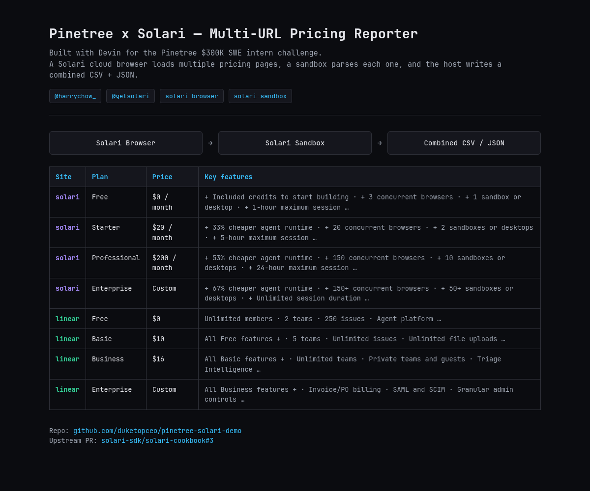

# Captured live run output

This is the exact result of a verified end-to-end multi-URL run on the Solari
Free plan, collecting `https://getsolari.com/pricing` and
`https://linear.app/pricing`.



## Command

```bash
python main.py
```

## Console output

```text
[solari] loading https://getsolari.com/pricing
[solari] title: Solari
WROTE {'csv': '/tmp/solari.csv', 'json': '/tmp/solari.json', 'plans': 4, 'site': 'solari'}
[linear] loading https://linear.app/pricing
[linear] title: Pricing – Linear
WROTE {'csv': '/tmp/linear.csv', 'json': '/tmp/linear.json', 'plans': 4, 'site': 'linear'}
wrote pricing.csv and pricing.json
```

## Extracted plans

### CSV

```csv
site,plan,price,description,features
solari,Free,$0 / month,Explore Solari and prototype your first agent.,+ Included credits to start building | + 3 concurrent browsers | + 1 sandbox or desktop | + 1-hour maximum session | + 1-day replay retention
solari,Starter,$20 / month,Build and launch with a small team.,+ 33% cheaper agent runtime | + 20 concurrent browsers | + 2 sandboxes or desktops | + 5-hour maximum session | + Stealth mode included
solari,Professional,$200 / month,Scale production agent workloads.,+ 53% cheaper agent runtime | + 150 concurrent browsers | + 10 sandboxes or desktops | + 24-hour maximum session | + Best self-serve rates
solari,Enterprise,Custom,Run mission-critical agents at any scale.,+ 67% cheaper agent runtime | + 150+ concurrent browsers | + 50+ sandboxes or desktops | + Unlimited session duration | + HIPAA compliance
linear,Free,$0,Free for everyone,Unlimited members | 2 teams | 250 issues | Agent platform | Linear Agent
linear,Basic,$10,Billed yearly,All Free features + | 5 teams | Unlimited issues | Unlimited file uploads | Admin roles
linear,Business,$16,Billed yearly,All Basic features + | Unlimited teams | Private teams and guests | Triage Intelligence | Loops | Code Intelligence | Linear Insights | Linear Asks | Zendesk and Intercom integrations
linear,Enterprise,Custom,Annual billing only,All Business features + | Invoice/PO billing | SAML and SCIM | Granular admin controls | Enterprise-grade security | Advanced org modeling | Migration & onboarding support | Priority support | Account management
```

### JSON

```json
{
  "plans": [
    {
      "site": "solari",
      "plan": "Free",
      "price": "$0 / month",
      "description": "Explore Solari and prototype your first agent.",
      "features": [
        "+ Included credits to start building",
        "+ 3 concurrent browsers",
        "+ 1 sandbox or desktop",
        "+ 1-hour maximum session",
        "+ 1-day replay retention"
      ]
    },
    {
      "site": "solari",
      "plan": "Starter",
      "price": "$20 / month",
      "description": "Build and launch with a small team.",
      "features": [
        "+ 33% cheaper agent runtime",
        "+ 20 concurrent browsers",
        "+ 2 sandboxes or desktops",
        "+ 5-hour maximum session",
        "+ Stealth mode included"
      ]
    },
    {
      "site": "solari",
      "plan": "Professional",
      "price": "$200 / month",
      "description": "Scale production agent workloads.",
      "features": [
        "+ 53% cheaper agent runtime",
        "+ 150 concurrent browsers",
        "+ 10 sandboxes or desktops",
        "+ 24-hour maximum session",
        "+ Best self-serve rates"
      ]
    },
    {
      "site": "solari",
      "plan": "Enterprise",
      "price": "Custom",
      "description": "Run mission-critical agents at any scale.",
      "features": [
        "+ 67% cheaper agent runtime",
        "+ 150+ concurrent browsers",
        "+ 50+ sandboxes or desktops",
        "+ Unlimited session duration",
        "+ HIPAA compliance"
      ]
    },
    {
      "site": "linear",
      "plan": "Free",
      "price": "$0",
      "description": "Free for everyone",
      "features": [
        "Unlimited members",
        "2 teams",
        "250 issues",
        "Agent platform",
        "Linear Agent"
      ]
    },
    {
      "site": "linear",
      "plan": "Basic",
      "price": "$10",
      "description": "Billed yearly",
      "features": [
        "All Free features +",
        "5 teams",
        "Unlimited issues",
        "Unlimited file uploads",
        "Admin roles"
      ]
    },
    {
      "site": "linear",
      "plan": "Business",
      "price": "$16",
      "description": "Billed yearly",
      "features": [
        "All Basic features +",
        "Unlimited teams",
        "Private teams and guests",
        "Triage Intelligence",
        "Loops",
        "Code Intelligence",
        "Linear Insights",
        "Linear Asks",
        "Zendesk and Intercom integrations"
      ]
    },
    {
      "site": "linear",
      "plan": "Enterprise",
      "price": "Custom",
      "description": "Annual billing only",
      "features": [
        "All Business features +",
        "Invoice/PO billing",
        "SAML and SCIM",
        "Granular admin controls",
        "Enterprise-grade security",
        "Advanced org modeling",
        "Migration & onboarding support",
        "Priority support",
        "Account management"
      ]
    }
  ]
}
```
