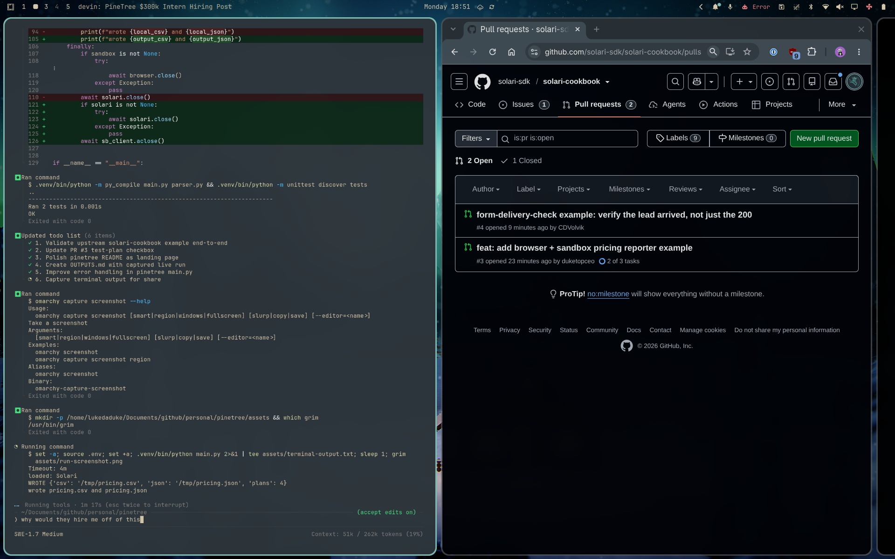

# Captured live run output

This is the exact result of a verified end-to-end run against
`https://getsolari.com/pricing` on the Solari Free plan.



## Command

```bash
python main.py
```

## Console output

```text
title: Solari
WROTE {'csv': '/tmp/pricing.csv', 'json': '/tmp/pricing.json', 'plans': 4}
wrote pricing.csv and pricing.json
```

## Extracted plans

### CSV

```csv
plan,price,description,features
Free,$0 / month,Explore Solari and prototype your first agent.,+ Included credits to start building | + 3 concurrent browsers | + 1 sandbox or desktop | + 1-hour maximum session | + 1-day replay retention
Starter,$20 / month,Build and launch with a small team.,+ 33% cheaper agent runtime | + 20 concurrent browsers | + 2 sandboxes or desktops | + 5-hour maximum session | + Stealth mode included
Professional,$200 / month,Scale production agent workloads.,+ 53% cheaper agent runtime | + 150 concurrent browsers | + 10 sandboxes or desktops | + 24-hour maximum session | + Best self-serve rates
Enterprise,Custom,Run mission-critical agents at any scale.,+ 67% cheaper agent runtime | + 150+ concurrent browsers | + 50+ sandboxes or desktops | + Unlimited session duration | + HIPAA compliance
```

### JSON

```json
{
  "plans": [
    {
      "plan": "Free",
      "price": "$0 / month",
      "description": "Explore Solari and prototype your first agent.",
      "features": [
        "+ Included credits to start building",
        "+ 3 concurrent browsers",
        "+ 1 sandbox or desktop",
        "+ 1-hour maximum session",
        "+ 1-day replay retention"
      ]
    },
    {
      "plan": "Starter",
      "price": "$20 / month",
      "description": "Build and launch with a small team.",
      "features": [
        "+ 33% cheaper agent runtime",
        "+ 20 concurrent browsers",
        "+ 2 sandboxes or desktops",
        "+ 5-hour maximum session",
        "+ Stealth mode included"
      ]
    },
    {
      "plan": "Professional",
      "price": "$200 / month",
      "description": "Scale production agent workloads.",
      "features": [
        "+ 53% cheaper agent runtime",
        "+ 150 concurrent browsers",
        "+ 10 sandboxes or desktops",
        "+ 24-hour maximum session",
        "+ Best self-serve rates"
      ]
    },
    {
      "plan": "Enterprise",
      "price": "Custom",
      "description": "Run mission-critical agents at any scale.",
      "features": [
        "+ 67% cheaper agent runtime",
        "+ 150+ concurrent browsers",
        "+ 50+ sandboxes or desktops",
        "+ Unlimited session duration",
        "+ HIPAA compliance"
      ]
    }
  ]
}
```
